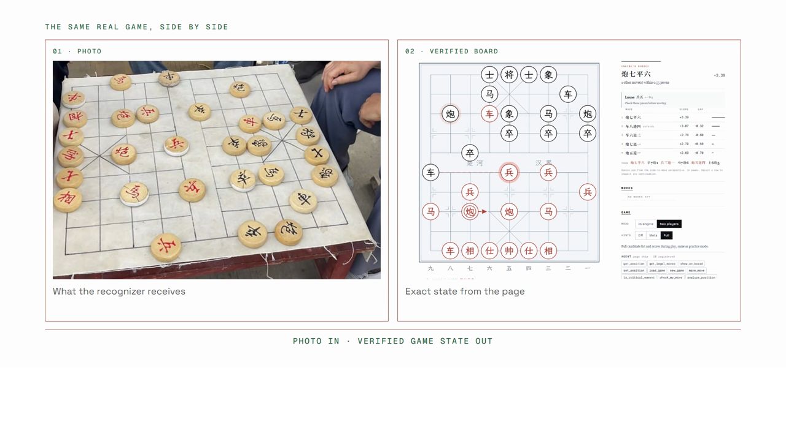

[English](README.md) | [简体中文](README.zh-CN.md)

# 中国象棋 WebMCP：如何赢得公园大爷的尊重

*不只拓宽信息的广度，也深入问题的深度：把一张公园棋局照片变成准确棋盘、深度引擎分析，以及你赢得大爷尊重的最佳机会。*



中国象棋 WebMCP 是一个中英双语的中国象棋应用。它在浏览器里运行真正的象棋引擎和专用的照片识别模型，并通过原生 WebMCP 工具让 AI 直接使用准确局面，而不是对着像素猜棋。

## 演示

演示使用一盘真实的公园棋局，完整展示照片导入、专用棋盘识别、人工核对、引擎候选着法排名，以及根据玩家问题调整表达方式的 AI 讲解。

[观看本地 56 秒演示](media/demo/chinese-chess-webmcp-demo.mp4)

[在 YouTube 观看最新演示](https://youtu.be/d60A0dA97Pw)

[打开中文版在线应用](https://alexzhangji.github.io/chinese-chess-webmcp/?lang=zh)

GitHub Pages 上部署的是完整应用。棋盘识别、透视校正、象棋引擎和 WebMCP 层都在浏览器内运行，不需要识别服务器或 API Key。

## Agent 快速上手

1. 在支持 WebMCP 的浏览器中打开[在线应用](https://alexzhangji.github.io/chinese-chess-webmcp/?lang=zh)。
2. 首先调用 `get_position`。返回结果会说明准确局面以及当前可用的工具。
3. 把 `tools_available` 当作当前能力边界。提示级别、摆棋模式和引擎就绪状态都会有意改变这份列表。
4. 如需测试照片识别，打开[内置公园棋局示例](https://alexzhangji.github.io/chinese-chess-webmcp/media/samples/park-game.png)，请用户把它拖入、粘贴或通过页面打开。用户需要在分析前确认还原棋盘和行棋方。
5. `analyze_position` 可用时，使用其结构化候选着法和后续变化回答用户真正关心的问题。也可以调用 `show_on_board`，把解释直接画在棋盘上。

### Agent 去哪里找数据

| 需要的数据 | 来源 |
| --- | --- |
| 当前棋盘、FEN、行棋方、历史记录和能力边界 | 调用 `get_position`。 |
| 合法着法 | 调用 `get_legal_moves`。 |
| 候选着法排名、评分、后续变化和威胁 | 当 `tools_available` 中出现 `analyze_position` 时调用它。 |
| 示例照片与经过验证的截图 | `media/samples/`，对应 URL 也会由 `get_position` 返回。 |
| 照片识别模型权重 | `cvmodel/hf-space/onnx/`。 |
| 浏览器象棋引擎与 NNUE 权重 | `engine/`。 |
| 示例棋局的准确标准答案 | `tests/photo_recognition_e2e.py`。 |

项目没有隐藏的应用数据库或识别后端。实时棋局状态由网页持有，Agent 通过 WebMCP 获得这份状态的可调用视图。

## 各项能力在哪里运行

| 能力 | 运行环境 | 网络行为 |
| --- | --- | --- |
| 照片识别 | 浏览器：RTMPose ONNX、全棋盘 ONNX 分类器、ONNX Runtime Web 和 OpenCV.js | 照片始终留在浏览器内。 |
| 局面校验 | 浏览器：与摆棋模式和 WebMCP 共用同一套 `rules.js` | 不发起网络请求。 |
| 深度分析 | 浏览器：Pikafish WebAssembly 与其 NNUE 权重 | 引擎搜索在本地完成。 |
| Agent 访问 | 浏览器：原生注册 `document.modelContext.registerTool` | 兼容宿主直接调用网页工具。 |
| 云库开局数据 | 启用分析或云库数据时，可选查询 `chessdb.cn` | 只发送局面 FEN，不发送照片。 |

## 为什么适合 WebMCP

许多 Agent 集成主要解决信息广度问题，例如搜索更多行、更多网页或更多记录。本项目探索的是与之互补的深度问题。

一张截图无法可靠地告诉 Agent 每个棋子的位置、全部合法着法、引擎评分、主要变化和潜在威胁。这些更深层的状态属于网页本身。专用识别器先把真实照片变成经过校验的棋盘，Pikafish 再在浏览器内搜索局面，最后由 WebMCP 以结构化形式暴露准确结果。

因此，AI 不只是复述唯一的最佳着法。它可以耐心教学、比较多个选择、解释某一枚棋子的最佳走法、评价用户考虑中的着法，或直接在棋盘上画出计划。网页提供准确状态和计算能力，AI 则根据具体的人调整表达方式。

## 从照片到棋盘

照片流程不使用视觉语言模型，也不会把图片发送给模型提供商。

1. 用户在网页中打开或粘贴一张中国象棋照片。
2. 专用 RTMPose ONNX 模型通过 ONNX Runtime Web 定位棋盘四角。
3. OpenCV.js 校正透视，把照片转换成规整的 10 行 9 列棋盘。
4. 专用全棋盘 ONNX 分类器在浏览器内识别 90 个交叉点，并返回每个点的置信度。
5. 同一套象棋规则实现检查棋子数量、九宫、士象可达位置、兵卒限制和将帅照面。
6. 原始照片与还原棋盘并排保留，便于人工核对。不确定或不合法的位置会被标出，不会被悄悄接受。
7. 用户确认轮到哪方走以后，同一局面就可以交给引擎和 WebMCP 使用。

如果以后加入纠错 fallback，它的职责也会受到严格限制：接收 ONNX 的初步结果，只检查低置信度或违反规则的位置。它不能从零重新猜测整张棋盘，修正后的结果仍必须通过同一套规则校验。

内置公园棋局示例通过端到端回归测试固定为以下经过验证的 FEN：

```text
3akab2/3n3r1/1c1Rb1n1c/4p1p1p/2p6/r3P1P2/2P5P/N1C1C1N2/9/1RBAKAB2 w - - 0 1
```

这个局面经过验证的首选着法是 `炮七平六`，对应 UCI `c3d3`，评分约为 `+3.4`。一次深度 17 的参考搜索给出 `+3.36`。按时间运行的实时搜索可能略有数值波动，但首选着法保持一致。

## 真正的 WebMCP 行为

在兼容宿主中，网页通过 `document.modelContext.registerTool` 注册真实工具。工具注册表是动态的，会反映当前时刻用户允许看到或执行的能力，而且每次调用都会再次检查同一边界。

普通浏览器中可见的工具面板是开发兼容层。它测试的是相同的工具契约，但不会假装所有浏览器都原生支持 WebMCP。

| 工具 | 能力 |
| --- | --- |
| `get_position` | 读取准确棋盘、FEN、行棋方、着法记录、局面评价和当前工具边界。 |
| `get_legal_moves` | 获取当前行棋方的全部合法着法，包括 UCI、中国象棋记谱、吃子和将军信息。 |
| `make_move` | 按要求在棋盘上走子，并在人机模式下接收引擎应手。 |
| `show_on_board` | 在真实棋盘上绘制带编号的箭头和简短说明。 |
| `set_position` | 从 FEN 进入摆棋模式，并运行网页的局面校验。 |
| `place_pieces` | 修正指定交叉点并重新运行校验。 |
| `load_game` | 从标准开局加载着法序列。 |
| `new_game`、`undo`、`resign` | 在与用户相同的界面权限下控制对局。 |
| `is_critical_moment`、`check_my_move` | 在不自动泄露最佳着法的前提下提供受控指导。 |
| `analyze_position` | 返回候选着法、评分、主要变化、云库结论和对方威胁。 |
| `review_game` | 复盘已加载或已完成的棋局，并给出每步等级和可发现深度。 |

引擎就绪前，与引擎相关的工具不会出现。提示设置也会有意限制建议能力，因此 Agent 可以围绕局面进行指导，而不会泄露超过用户要求的信息。

## 本地运行

仓库已包含 ONNX 模型和浏览器运行时。照片识别只使用 CPU，数据留在设备上，不需要 API Key 或 Python 包。

Windows PowerShell：

```powershell
py -3 serve.py 8794
```

macOS 或 Linux：

```bash
python3 serve.py 8794
```

打开 `http://127.0.0.1:8794/?lang=zh`。不要通过 `file://` 直接打开 `index.html`。

内置服务器提供：

- 多线程 Pikafish WebAssembly 所需的 COOP 和 COEP 响应头。
- 可选的 Python `/api/board` 参考路径，用于识别回归测试和批量标注。正式产品的上传流程不依赖它。

## 浏览器和部署要求

- 支持 WebAssembly 的现代浏览器。在支持 Service Worker 的静态托管环境中，内置隔离辅助程序会启用引擎的多线程构建。
- 如需 Agent 直接调用工具，需要原生 WebMCP 支持。普通浏览器可以使用可见兼容面板测试工具契约。

GitHub Pages 托管完整的静态应用。`browser-cv.js` 运行相同的两个 ONNX 权重，并通过 ONNX Runtime Web 和 OpenCV.js 复现 Python/OpenCV 参考预处理。上传的图片不会离开浏览器。

## 测试

运行 JavaScript 检查：

```bash
node tests/t.js
node tests/globals.js
```

浏览器上传流程也已经在无头 Chrome 中使用真实公园照片测试。若需与可选的 Python 参考实现做精确一致性测试：

```powershell
py -3.10 -m venv cvmodel\.venv
cvmodel\.venv\Scripts\python.exe -m pip install -r requirements.txt
cvmodel\.venv\Scripts\python.exe tests\photo_recognition_e2e.py
```

照片回归测试使用 `media/samples/park-game.png` 中的真实示例，只有完整识别 FEN 精确一致时才会通过。

## 语言与记谱

使用 `?lang=en` 打开英文界面，使用 `?lang=zh` 打开中文界面。棋子文字和中国象棋记谱始终保留中文，因为它们就是应用所处理的对象。工具响应会在适合的位置同时提供 UCI 坐标。

## 项目结构

- `index.html`、`app.js`、`rules.js`、`webmcp.js`、`i18n.js`：应用与 WebMCP 实现。
- `browser-cv.js`：正式浏览器识别流程，包括方向选择、置信度处理和规则校验。
- `cvmodel/`：两个 ONNX 权重及可选 Python 参考实现。
- `vendor/`：固定版本的 ONNX Runtime Web 和 OpenCV.js 浏览器运行时。
- `tools/board_cv.py`：回归测试和标注工具使用的可选 Python 识别适配器。
- `engine/`：Pikafish WebAssembly 运行时和内置 NNUE 权重。
- `tests/`：规则、WebMCP 契约和真实照片端到端回归测试。
- `media/`：经过验证的示例素材和演示视频。

## 许可证与第三方说明

应用代码采用 GPL-3.0。Pikafish 源码和浏览器构建遵循其上游说明。棋盘识别源码仓库没有声明许可证。重新分发前请阅读 [`LICENSE`](LICENSE)、[`THIRD_PARTY.md`](THIRD_PARTY.md) 以及 `engine/` 目录中的说明。
